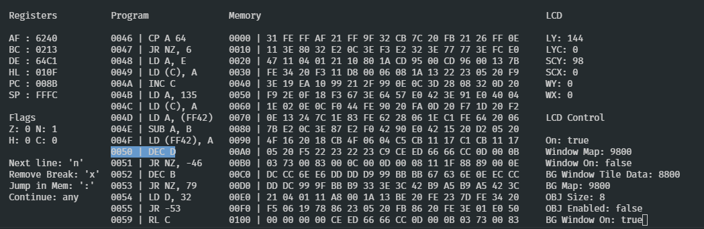

# DMG_EMU rs

## Instalation

Place roms in the `resources` folder.

`cargo build`

`cargo run "name_or_rom.gb"`

If not name is supplied the emulator will try to run the boot rom named `DMG_ROM.bin` which is not provided for obviouse reasons. It also tries to read the nintendo logo from `nintendo_logo.txt` which, you guessed it, is also not provided.
## Design notes

### EMU

The emulator library consists of the CPU, PPU, MMU, and Debug modules. The emulator is responsible for the following actions in this order
- Check for breakpoints
- Draw the debug menu
- Poll for Debug Events
- Tick the CPU
- Tick the PPU

Then repeat. ez. 

### CPU

The cpu attempts to simulate cycle accuracy by breaking up each command into the descrete actions the cpu would take at that step. To do this the cpu sometimes needs to pull data from memery and yield back to the emulator so it can tick the PPU. So the CPU has a simple state machine that keeps track of which step it is in executing an instruction. Preferably we would use co-routines but those don't exist in rust yet.

#### The LD A (HL) isntruction would look something like this

 - Fetch the op code (1 cycle)
 - Fetch the value from memory at address stored in HL (1 cycle)
 - Place in A (0 cycles)

### PPU

#### One PPU Cycle

 - Push a pixel / Read Tile Num
 - Push a pixel / WAIT
 - Push a pixel / Read high row
 - Push a pixel / WAIT
 - Push a pixel / Read low row
 - Push a pixel / WAIT
 - Push a pixel / IDLE
 - Push a pixel / Place the data into the FIFO

For each machine cycle the PPU will push two pixels and grab the next tile row, number, push etc.

### MMU

The MMU is primarely responsible for mapping the variouse memory modules and devices to their addresses. It is passed into the cpu and ppu so they can read and write to it.

### Debug

Debugging a rom is done in the console. The state of the emulator is dumped to the console when a breakpoint is reached. Current;y breakpoints must be set in the binary but hopefully I'll come up with something else. 

When in the debugging you can use:
- n To tick the emulator till the next line is reached
- x To remove a breakpoint from the current line
- : To move the memory debug to an address
- + To add a breakpoint to a line
- c To continue execution
- arrow up To scroll the memory debug up a line
- arrow down To scroll the memory debug down a line

### Modules

The Input and Display modules are expected to plugin to the emulator. The base executable comes with winit and pixel support. But you could implement any kind of frontend for the engine by connecting `emu.ppu.draw` and `emu.set_button(button: char | string | Button, value: bool)` this way the emulator will have a display to draw out too and buttons to receive input from.

### Threading

The binary threads the winit window and the emulator seperately so that the emulator can block on a breakpoint without preventing the window from resiving, moving, or changing monitors. 

### Testing

 - Blarggs Tests
   - 01-special all but last ⚠
   - 07-jr,jp,call,ret,rst passes ✔
   - all others fail ❌

 - dmg-acid2
   - bottom of eyes is drawn incorrectly ❌
   - Everything else ✔
